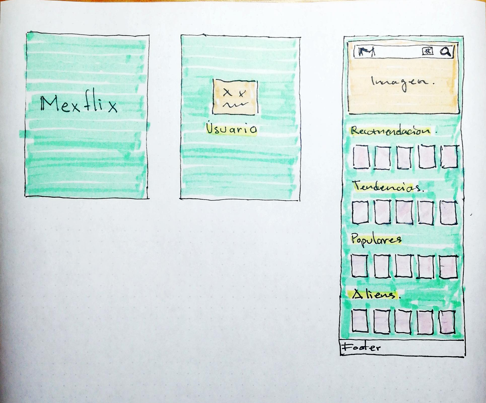

# Proyecto 04-Mexflix(Movie-hub)

Aplicacion para consultar un catalogo de peliculas diseñado especificamente para un grupo de usuarios, en este caso, ciencia ficción o comunmente conocido como Sci-Fi

---

## 1.Definition

El usuario quiere consultar una selección apropiada de recomendaciones de su interes

El usuario quiere ver un catalogo de peliculas pre-seleccionadas

El usuario quiere ser capaz de buscar perliculas por titulo, genero y actores invilucrados.

### Propuestas

Para cumplir los requerimientos del usuario se desarrollara una aplicación pensada para dispositivos mobiles y para dispositivos de formato "grande". Donde el usuario podra consultar informacion de peliculas de Sci-Fi, se mostrara en pantalla recomendaciones de peliculas bien calificadas por la critica, tendencias, populares, aliens, etc.

Se planea integrar autentificación en el proyecto para personalizar la busqueda, posiblemente la aplicacion contara con una pantalla de bienvenida y/o autentificacion.

### Viabilidad

Si el tiempo de desarollo lo permite se implementara la caracteristica de autentificación, en caso de no contar con el tiempo suficiente el proyecto se centrara en el objetivo principal, que es mostrar un catalogo personalizado.

---

## 2.Diseño

El proyecto, tentativamente, contara con una pantalla de bienvenida, donde se mostrara el nombre del proyecto.

Seguido de la pantalla de bienvenida se mostrara la pantalla del usuario y posiblemente pedira la auntentificación.

Finalmente se mostrara el catalogo personalalizado dirigido a los usuarios con predileccion a la ciencia ficción.




### Pseudocodigo general

```

Mostrar pantalla de bienvenida
Mostrar pantalla de usuario y/o contraseña despes de 2 segundos
pedir contraseña
si es incorrecta no hacer nada
si es correcta mostrar pantalla donde se ubican las peliculas pre-establecidas(pantalla "home")
si se hace 'click' en alguna pelicula muestra un alert con la información de la pelicula
si se da 'click' en un boton **buscar**, imprime en pantalla peliculas que coincidan con un **input** que el usuario ingrese
en todo el flujo, se mostrara un boton con la funcionalidad de regresar a la pantalla "home"

```
